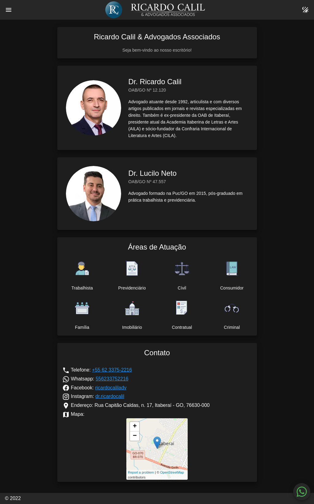

[](https://app.netlify.com/sites/calilfonseca/deploys)

<br />
<p align="center">
  <h3 align="center">Calil Fonseca & Advogados Associados</h3>

  <p align="center">
	Calil Fonseca & Advogados Associados is a law firm based in Itaberaí, Goiás, Brazil.
	This project is a landing page for the website of the firm.
	<br />
	:warning: This project is deprecated in favor of <a href="https://github.com/xandao6/ricardo-calil"><strong>Ricardo Calil Project</strong></a> :warning:
    <br />
	<br />
    <a href="https://github.com/xandao6/calil-fonseca"><strong>Explore the docs »</strong></a>
    <br />
    <a href="https://github.com/xandao6/calil-fonseca/issue">Report Bug</a>
    ·
    <a href="https://github.com/xandao6/calil-fonseca/issues">Request Feature</a>
  </p>
</p>


<!-- TABLE OF CONTENTS -->
<details open="open">
  <summary>Table of Contents</summary>
  <ol>
    <li>
      <a href="#about-the-project">About The Project</a>
      <ul>
        <li><a href="#features">Features</a></li>
        <li><a href="#built-with">Built With</a></li>
      </ul>
    </li>
    <li>
      <a href="#getting-started">Getting Started</a>
      <ul>
        <li><a href="#installation">Installation</a></li>
      </ul>
    </li>
    <li><a href="#usage">Usage</a></li>
    <li><a href="#roadmap">Roadmap</a></li>
    <li><a href="#contributing">Contributing</a></li>
    <li><a href="#license">License</a></li>
    <li><a href="#contact">Contact</a></li>
    <li><a href="#acknowledgements">Acknowledgements</a></li>
  </ol>
</details>


<!-- ABOUT THE PROJECT -->
## About The Project

<div align="center">
  <a href="https://github.com/xandao6/calil-fonseca">
    
  </a>
</div>

### Features

* Office card
* Lawyers cards
* Expertise area card
* Contact card
* Dark mode toggle
* Responsive design

### Built With

* [Nuxt.js](https://nuxtjs.org/) - The intuitive Vue Framework
* [Vue.js 2](https://vuejs.org/) - A progressive framework for web development
* [Vuetify](https://vuetifyjs.com/en/) - A Vue UI Library with beautifully handcrafted Material Components


<!-- GETTING STARTED -->
## Getting Started

To get a local copy up and running follow these simple steps.

### Installation

1. Clone the repo
   ```sh
   git clone https://github.com/xandao6/calil-fonseca.git
   ```
2. Install dependencies
   ```sh
	cd calil-fonseca
	npm install # or yarn install
	```

<!-- USAGE EXAMPLES -->
## Usage

* Starts the development server
	```sh
  npm run dev # or yarn dev
  ```
* Launch production server
  ```sh
  npm run build # or yarn build
  npm run start # or yarn start
  ```
* Generate a static version of the website
  ```sh
  npm run generate # or yarn generate
  ```

<!-- ROADMAP -->
## Roadmap

See the [open issues](https://github.com/xandao6/calil-fonseca/issues) for a list of proposed features (and known issues).


<!-- CONTRIBUTING -->
## Contributing

Contributions are what make the open source community such an amazing place to be learn, inspire, and create. Any contributions you make are **greatly appreciated**.

1. Fork the Project
2. Create your Feature Branch (`git checkout -b feature/AmazingFeature`)
3. Commit your Changes (`git commit -m 'Add some AmazingFeature'`)
4. Push to the Branch (`git push origin feature/AmazingFeature`)
5. Open a Pull Request

<!-- LICENSE -->
## License

All rights reserved.

<!-- CONTACT -->
## Contact

Alexandre Calil - [@xandao6](https://www.linkedin.com/in/xandao6/) - alexandrecalilmf@gmail.com

Project Link: [https://github.com/xandao6/calil-fonseca](https://github.com/xandao6/calil-fonseca)

## Acknowledgements

* [TypeScript](https://www.typescriptlang.org/) - strongly typed JavaScript
* [eslint](https://github.com/eslint/eslint) - code quality linter
* [prettier](https://github.com/prettier/prettier) with [eslint plugin](https://github.com/prettier/eslint-plugin-prettier) and [eslint config](https://github.com/prettier/eslint-config-prettier) - formatter linter with eslint integration
* [mdi](https://materialdesignicons.com/) - icons used in the project
* [jest](https://jestjs.io/) - unit testing framework
* [babel](https://babeljs.io/) - converts modern JavaScript into backwards compatible code


<!-- LINKS & IMAGES Variables-->
<!-- https://www.markdownguide.org/basic-syntax/#reference-style-links -->
[contributors-shield]: https://img.shields.io/github/contributors/xandao6/repo.svg?style=for-the-badge
[contributors-url]: https://github.com/xandao6/repo/graphs/contributors
[forks-shield]: https://img.shields.io/github/forks/xandao6/repo.svg?style=for-the-badge
[forks-url]: https://github.com/xandao6/repo/network/members
[stars-shield]: https://img.shields.io/github/stars/xandao6/repo.svg?style=for-the-badge
[stars-url]: https://github.com/xandao6/repo/stargazers
[issues-shield]: https://img.shields.io/github/issues/xandao6/repo.svg?style=for-the-badge
[issues-url]: https://github.com/xandao6/repo/issues
[license-shield]: https://img.shields.io/github/license/xandao6/repo.svg?style=for-the-badge
[license-url]: https://github.com/xandao6/repo/blob/master/LICENSE.txt
[linkedin-shield]: https://img.shields.io/badge/-LinkedIn-black.svg?style=for-the-badge&logo=linkedin&colorB=555
[linkedin-url]: https://linkedin.com/in/xandao6
